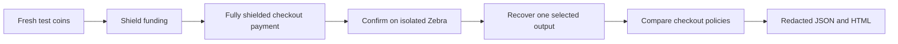

# ShieldCheck

**A valid shielded payment can still end in a leaky checkout.**

ShieldCheck reproduces that gap with a real Zcash regtest payment. It compares a deliberately vulnerable checkout with a corrected one, then produces a redacted report of settlement, receipt validation, order access and observed disclosures.

The central test is simple: copy a valid payment receipt and try to claim the order before its owner. Both checkouts verify the same native payment. The vulnerable checkout grants access; the corrected checkout requires the separate order capability and denies the copy.

This is a local benchmark for our own fixtures. It is not a production checkout, a general traffic scanner or a privacy certification.

[Open the recorded report](examples/benchmark-report.html) · [JSON result](examples/benchmark-result.json) · [Disposable chain evidence](examples/chain-evidence.json)

The September 28 native run passed all 24 benchmark expectations at block 103: detected memo and receipt disclosures, copied-receipt acceptance in the vulnerable fixture, and denial plus one-time authorized access in the corrected fixture. All 22 Node tests, 18 Rust tests and six launcher controls pass. Browser rendering has not been visually verified.

Recorded implementation: `21478fcc87de3c6dddf878f5c910cf5b4419fe9e`. The chain-evidence file pins the native binary and JSON report hashes for this run.

## Run

The verified launcher targets Windows with PowerShell 7.4+, Node.js 24+, Rust/Cargo, and an installed `Ubuntu-24.04` WSL distribution. It downloads a pinned Zebra 6.4.2 Linux release, checks the archive hash, builds the native fixture and creates an isolated node with no peers. The first Rust build can take several minutes.

From this repository:

```powershell
npm test
pwsh -NoProfile -File ./scripts/run-regtest.ps1
```

Open the resulting `reports/<run>/report.html`. Its sibling `report.json` is the machine-readable result. The launcher stops its node after the run, including application-failure paths. Runtime diagnostics stay in ignored `.local/runs/<run>/`.

Use an existing official archive without downloading again:

```powershell
pwsh -NoProfile -File ./scripts/run-regtest.ps1 -ZebraArchive ./downloads/zebrad-6.4.2-x86_64-unknown-linux-gnu.tar.gz
```

`-NoBuild` reuses the current native release binary. Omit it after changing Rust code. `-Distribution` selects an installed WSL distribution. `-ReportDirectory` selects a new output directory; existing directories are refused. No wallet setup, faucet or real funds are required.

## Read the result

| Result | Meaning |
| --- | --- |
| Native settlement verified | Zebra accepted and confirmed the fully shielded checkout payment after a separate funding transaction. |
| Copied receipt granted access | The deliberately vulnerable fixture broke its declared order-access policy. |
| Copied receipt denied; owner granted once | The corrected fixture enforced the separate capability and one-time claim. |
| Canary finding | Registered payment data appeared in a forbidden captured sink. The value itself is removed from the report. |
| No observed canary findings | The stated completed capture contained none of the registered representations. Unobserved surfaces remain unknown. |
| Incomplete | Required native, application or capture evidence was missing. It cannot count as a pass. |

Exit `0` means the benchmark observed its expected failures and passing controls. Exit `1` means an expectation failed. Exit `2` means required evidence was incomplete. Usage errors exit `64`. Deliberate fixture failures are expected findings; they do not make the benchmark itself unsuccessful.

## How it works



Rust owns native transactions and selected-output recovery. Node drives real loopback checkout HTTP requests and captures the checkout child's stdout/stderr plus its designated telemetry endpoint. Known canaries are checked in raw, URI-encoded and Base64 forms.

A selected-output receipt reveals its recipient, amount and memo. It proves neither the payer's identity nor the presenter's right to claim an order. The corrected fixture keeps order authorization separate and out of the payment memo. A bearer-receipt product can choose a different policy; this benchmark explicitly requires the separate capability.

Read the [coverage and trust model](docs/benchmark.md) and [native interface](docs/native-contract.md). The current native fixture uses NU6.3's Ironwood pool. It trusts its local full node for chain state and uses one confirmation for disposable tests.

## Development

```powershell
npm test
pwsh -NoProfile -File ./test/launcher.test.ps1
cargo test --locked --release --manifest-path native/Cargo.toml
cargo fmt --manifest-path native/Cargo.toml -- --check
cargo clippy --locked --manifest-path native/Cargo.toml --all-targets -- -D warnings
```

Contract tests that substitute a verifier prove application behavior only. The launcher run is required to establish native payment and receipt evidence. Direct CLI use is available for a separately owned fresh node:

```powershell
$nativeExe = (Resolve-Path ./native/target/release/shieldcheck-native.exe).Path
node ./src/cli.mjs --native $nativeExe --rpc-port 18232 --out ./reports/my-new-run
```

The node must match the exact isolated regtest context in the native contract. The CLI refuses to substitute simulated settlement when native verification is unavailable.

## Project status

ShieldCheck is new work for the 2026 ZECATHON Core & Tooling track. This first milestone is a local native benchmark. External application integration, developer validation, a hosted demo and final event submission remain separate work. No claim of an existing ecosystem vulnerability is made.

MIT licensed. Rust dependency versions and upstream licenses are recorded through `native/Cargo.lock` and the referenced upstream projects; Zebra remains separately licensed tooling.
