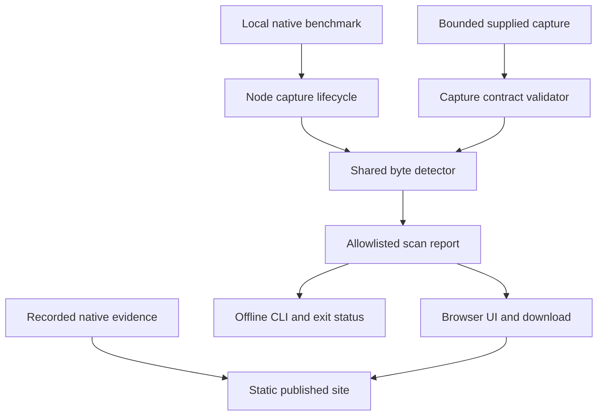
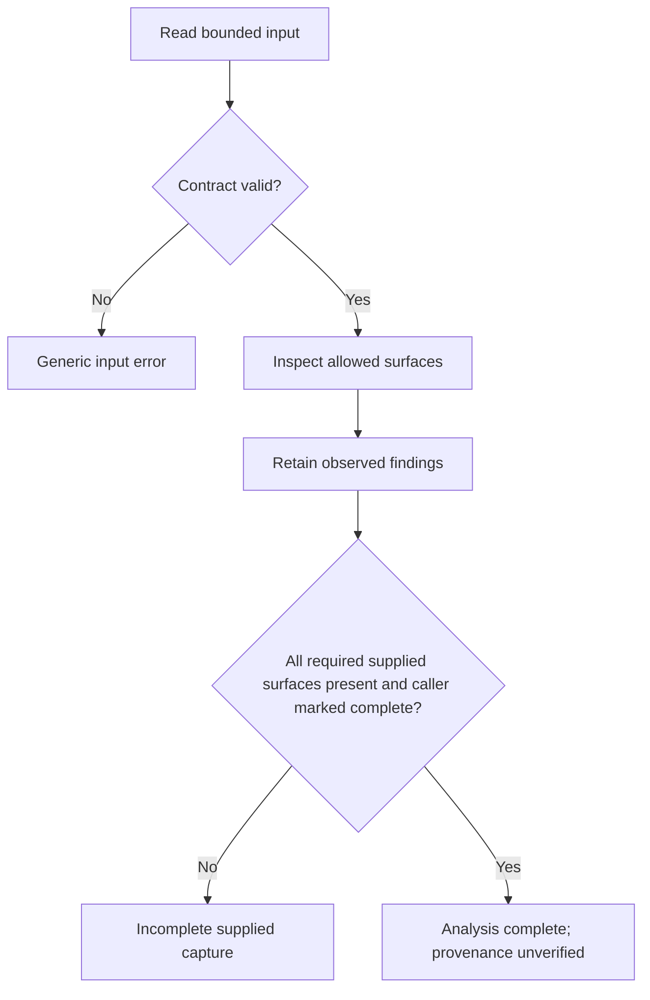
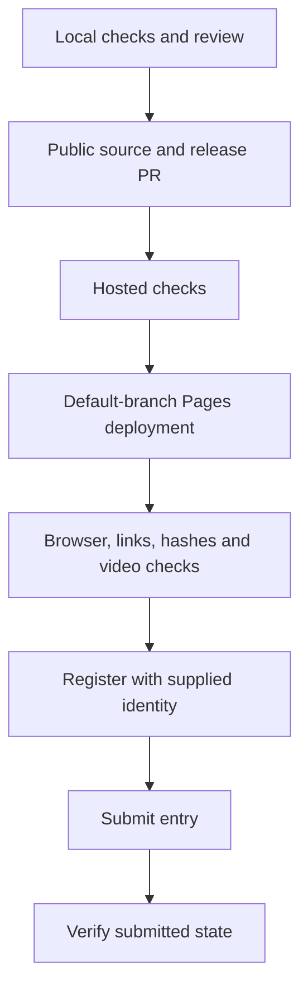

# ShieldCheck Public Release and Submission - Plan

## Goal Capsule

**Objective:** Developers and ZECATHON judges can use ShieldCheck online, reproduce its native evidence, and evaluate a submitted Core & Tooling entry.

**Means:** A browser-local capture analyzer and downloadable CLI share the benchmark's detector; a static site presents the native evidence and a two-minute demonstration (KTD1–KTD3).

**Authority:** The user's request to deploy and submit, repository instructions, Product Contract, then Planning Contract. The coordinator finishes review, publication and submission. Workers own assigned files and do not commit.

**Execution profile:** Implement and verify locally, publish reviewed code to a new public repository, deploy through passing CI, then submit verified links. Account choice and Telegram contact are user-supplied dependencies for registration; their absence does not block implementation.

**Stop conditions:** Do not invent identity/contact data, bypass an authentication challenge, spend real funds or publish private runtime artifacts. Report an external blocker precisely if it prevents submission.

---

## Product Contract

### Summary

Ship a public ShieldCheck demo that performs useful disclosure analysis in the visitor's browser. Connect it to the recorded native checkout benchmark, an offline developer interface and a reproducible open-source release. Complete the event entry with the deployed demo and two-minute video.

### Problem Frame

The verified benchmark currently requires a local Windows/WSL setup. Judges cannot inspect its behavior through a public URL, and developers cannot use its disclosure detector against their own test captures without editing the benchmark.

### Requirements

**Usable analysis**

- R1. Browser and CLI analyze bounded synthetic canaries and supplied captures with the same disclosure detector used by the native benchmark.
- R2. Reports contain only allowlisted finding metadata and distinguish supplied-capture analysis from native verification and proven capture completeness.
- R3. Missing, malformed or oversized inputs produce an explicit error or incomplete result, while already observed findings survive incomplete coverage.

**Public demonstration**

- R4. The responsive demo provides leaky, corrected and incomplete synthetic examples, local file inspection and a redacted report download without sending capture contents or canaries to a server.
- R5. The site separately presents the dated real native benchmark, unchanged downloadable evidence, reproduction instructions and the limits of each evidence source.

**Release and entry**

- R6. Publish reviewed source under the existing license, passing hosted checks and a working HTTPS demo whose deployed bytes match the release.
- R7. Publish an accessible two-minute demonstration of actual product behavior and submit the required name, track, description, repository, demo and video links, then verify submitted state.
- R8. Preserve the existing native safety boundaries: disposable isolated regtest, loopback-only vulnerable fixtures, redacted publication and no privacy-certification claims.

### Acceptance Examples

- AE1. Covers R1–R4. Selecting the leaky example finds full memo and receipt canaries in the stated raw/URI/Base64 forms; the downloaded report includes no canary values or captured text.
- AE2. Covers R2–R4. The corrected example reports no registered canary findings in supplied captures, without claiming complete observation or universal privacy.
- AE3. Covers R3. A declared incomplete capture that contains a leak retains that finding and an incomplete status; absent required surfaces and oversized data never become a clean result.
- AE4. Covers R4–R5. After loading the site, editing and analyzing input produces no network transmission of that input. Opening recorded evidence never changes its timestamp or native result in response to a browser action.
- AE5. Covers R6–R7. A signed release resolves to passing checks and a reachable demo/video; the event account displays submitted state after the final edit.

### Scope Boundaries

The public product analyzes supplied test captures; it does not operate a public checkout, accept real payments or certify an external application. A documented capture adapter is not an independent developer adoption claim. Existing pre-event private applications remain excluded. Native challenge expiry and platform-containment limits remain documented.

---

## Planning Contract

### Key Technical Decisions

- KTD1. **Keep hosting static.** GitHub Pages serves an explicit allowlist of site assets and redacted evidence. The existing loopback checkout and native runner remain local, satisfying R4–R6 and R8.
- KTD2. **Extract one portable detector.** A small dependency-free module uses UTF-8 bytes and canonical single-layer Base64 decoding. Existing Node capture lifecycle logic delegates only matching; browser and CLI use the same module (R1).
- KTD3. **Use a separate supplied-capture contract.** The versioned input has allowlisted canary fields and capture surfaces, explicit caller-supplied completeness, and strict size/count limits. Its separate report schema always identifies provenance as unverified and native settlement as not evaluated (R2–R3).
- KTD4. **Treat imported values as private untrusted text.** No analytics, remote fonts, form posts, persistent storage or input-derived markup. Use a restrictive CSP and fixed redacted output fields; errors exclude input text and local filenames (R2–R4).
- KTD5. **Publish through verified commits.** Create a new repository, preserve the signed native baseline, review the release diff, then land a release PR and deploy only the verified default-branch revision. Pin current first-party action SHAs, Node 24, a compatible Rust toolchain and explicit runner OS versions (R6).
- KTD6. **Submit only verified artifacts.** Host the demonstration alongside the static site or as a public release asset with a stable player page. Use the event's visible form and preserve a private receipt of its final submitted state (R7).

### Assumptions

GitHub Pages is the default host because the existing GitHub account is authenticated and a static analyzer needs no paid backend. The audience is Zcash application developers and hackathon judges. Presentation will be a legible light technical report with a warm amber accent. These are reversible release choices, not established user design preferences.

The browser feature is analysis, not a simulated native checkout. External developer feedback remains unverified unless actually obtained; submission copy must say so when discussing adoption.

### Technical Design

### Risks and Dependencies

Extraction can change binary matching; preserve existing encoding tests and compare Node/browser results. Supplied captures cannot establish network coverage; KTD3 prevents that claim. Pages cannot run Rust or a node; R5 keeps native evidence distinct. Account login, Telegram contact and event availability can block only the final entry operation. A video must show actual interactions or explicitly labeled recorded evidence.

---

## Implementation Units

### U1. Portable detector and offline capture interface

**Goal:** Make the current detector useful from external test harnesses without weakening its evidence boundaries.

**Requirements:** R1–R3, R8; KTD2–KTD4. **Dependencies:** None.

**Files:** `src/disclosures.mjs`, `src/coverage.mjs`, `src/scan.mjs`, `src/scan-cli.mjs`, `test/coverage.test.mjs`, `test/scan.test.mjs`, `test/scan-cli.test.mjs`, `examples/capture-input.json`, `docs/capture-contract.md`.

**Approach:** Extract matching while retaining the existing Node capture owner. Define a bounded versioned contract and separate redacted report. Support file and stdin input, no secret-bearing command arguments. Use fixed error codes and distinguish leak findings, incomplete input and malformed input in CLI exit codes.

**Patterns:** `Capture.findings`, `evaluateCoverage`, and allowlisting in `src/render.mjs`.

**Test scenarios:**

- Preserve raw, WHATWG/query URI and Base64 byte-alignment, padding, Unicode and near-match behavior.
- Reject malformed documents, unknown/duplicate fields or surfaces, excessive canary lengths/counts and missing required captures.
- Covers AE3. Preserve a detected leak when supplied coverage is incomplete or a capture exceeds its limit.
- Covers AE1–AE2. Browser-compatible API and CLI give identical redacted findings; stderr/stdout never include supplied values, arbitrary labels or local input paths.

**Verification:** Existing detector and process tests remain green; new API/CLI controls establish the public contract.

### U2. Public browser analyzer and native evidence presentation

**Goal:** Let judges and developers use the analyzer immediately and inspect native evidence separately.

**Requirements:** R1–R5, R8; KTD1–KTD4. **Dependencies:** U1 interface.

**Files:** `web/index.html`, `web/styles.css`, `web/app.mjs`, `web/samples.mjs`, `scripts/build-site.mjs`, `scripts/serve-site.mjs`, `test/site.test.mjs`, `README.md`.

**Approach:** Build a responsive static page with synthetic presets, bounded local JSON import, explicit errors and redacted JSON download. Keep evidence timestamp and provenance visible. Build only approved files into ignored `dist/`; copy recorded examples byte-for-byte. Use relative URLs compatible with the Pages repository subpath.

**Test scenarios:**

- Covers AE1–AE4. Exercise all presets, local import, reset, validation errors and report download in a real browser.
- Malicious text is displayed as text and cannot create elements, execute script or affect download names.
- Check keyboard operation, narrow viewport, visible focus, readable status, request log and console.
- Build rejects evidence hash mismatch and excludes runtime/private files; site links and modules resolve under a repository subpath.

**Verification:** Automated site checks and local desktop/mobile browser inspection pass. Browser/native settlement distinction is visible at the result itself. U3 owns deployed browser acceptance.

### U3. Reproducible public release and deployment

**Goal:** Publish verifiable source and a stable live demo.

**Requirements:** R5–R6, R8; KTD1, KTD5. **Dependencies:** U1–U2.

**Files:** `.github/workflows/ci.yml`, `.github/workflows/pages.yml`, `package.json`, `.gitignore`, `README.md`, `docs/release.md`.

**Approach:** Add Node Windows/Linux checks, native release tests/format/Clippy and Windows launcher controls. Keep hosted checks distinct from fresh native settlement evidence. Review history for private data before the first public push. Use explicit site artifact paths, least job permissions and ordered Pages deployments. Publish a verified candidate for demonstration recording; create the final signed source release only after U4's demonstration assets are committed, reviewed, checked and verified live.

**Test scenarios:**

- Clean source setup runs the documented scanner and static build.
- Hosted Windows and Linux Node jobs pass; native Rust job passes on its declared platform.
- Public site files and recorded evidence match the local approved artifact hashes.
- Failed checks cannot publish a newer site; an older run cannot overwrite a newer deployment.

**Verification:** Public repository and deployed candidate resolve to the reviewed revision, checks are terminal and successful, and live HTTPS demo passes browser acceptance. Final release verification follows U4's demonstration assets.

### U4. Demonstration and verified event submission

**Goal:** Give judges a concise, accurate entry with working links.

**Requirements:** R5–R7; KTD6. **Dependencies:** U3; user-supplied registration identity and Telegram contact for final submission only.

**Files:** `web/demo.html`, `web/demo.vtt`, `docs/demo-script.md`, `docs/submission.md`; video asset location selected within static/release size limits.

**Approach:** Record actual analyzer interaction and show the dated native evidence. Produce a two-minute video with readable captions, a stable player link and transcript. Commit and review the demonstration assets, pass checks and deployed acceptance, then create the final signed release of that complete revision. Describe working components and limitations within the form's 2,000-character limit. Register, select Core & Tooling, submit, and capture the visible submitted state privately.

**Test scenarios:**

- Video duration, playback, captions and hosted links work without login.
- Description claims match verified behavior and distinguish local analysis from native evidence.
- Covers AE5. Reloading the account after submission retains submitted state and correct URLs.

**Verification:** All required fields are accepted and final submitted state is observed. A draft or prepared form does not satisfy this unit.

---

## Verification Contract

Run `npm test` for Node and scanner contracts, `npm run build:site` for the allowlisted static artifact, locked Rust release tests plus formatting/Clippy, and `pwsh -NoProfile -File ./test/launcher.test.ps1` for launcher controls. After detector changes, run the documented full native launcher once on the verified Windows/WSL environment. Preserve the existing recorded native artifacts as historical evidence and compare the new run's expectations.

Inspect actual local and hosted browser behavior, desktop and narrow viewport, imported-input redaction, download contents, no input-bearing requests and video playback. Hosted CI proves only its executed jobs. Public source history, generated site bytes and release artifacts require explicit private-data and hash checks before publication.

## Definition of Done

U1–U3 are complete only after integrated checks, actionable review fixes, source publication and deployed acceptance. U4 is complete only after the video is publicly playable and final event submitted state is verified. Preserve current user edits and remove abandoned experiment code. Record any external blocker and remaining unverified claims in the private task record; do not call a blocked or draft entry submitted.
